# Technical Documentation and Project Management Appendices

**Project:** SCIM / Great Solomon Supply Chain Services  
**Repository:** [franvaliente24-creator/scim](https://github.com/franvaliente24-creator/scim)  
**Repository ID:** 1378701901  
**Baseline:** `main`, inspected September 22, 2026  

> **Evidence note.** This appendix is based on the repository files and deployment notes available at the time of inspection. Items that are not represented in the repository—such as automated tests, CI workflow files, meeting minutes, sprint history, formal licensing, and production monitoring—are explicitly identified as recommendations, templates, or unavailable evidence rather than being presented as implemented facts.

## Appendix A: Detailed Technical Documentation

### A.1 System Architecture

SCIM is a browser-based supply-chain operations application. The visible frontend is implemented with HTML, CSS, and JavaScript pages. PHP provides a single API entry point at `api/index.php`; it manages sessions, authentication, authorization, database access, and JSON responses. MariaDB/MySQL stores operational data. The application can run under PHP 8.2+ with Apache or in the supplied `php:8.2-apache` Docker image.

The main functional areas are dashboard, smart warehousing, inventory, procurement, suppliers, purchase orders, documents/logistics, and user management.

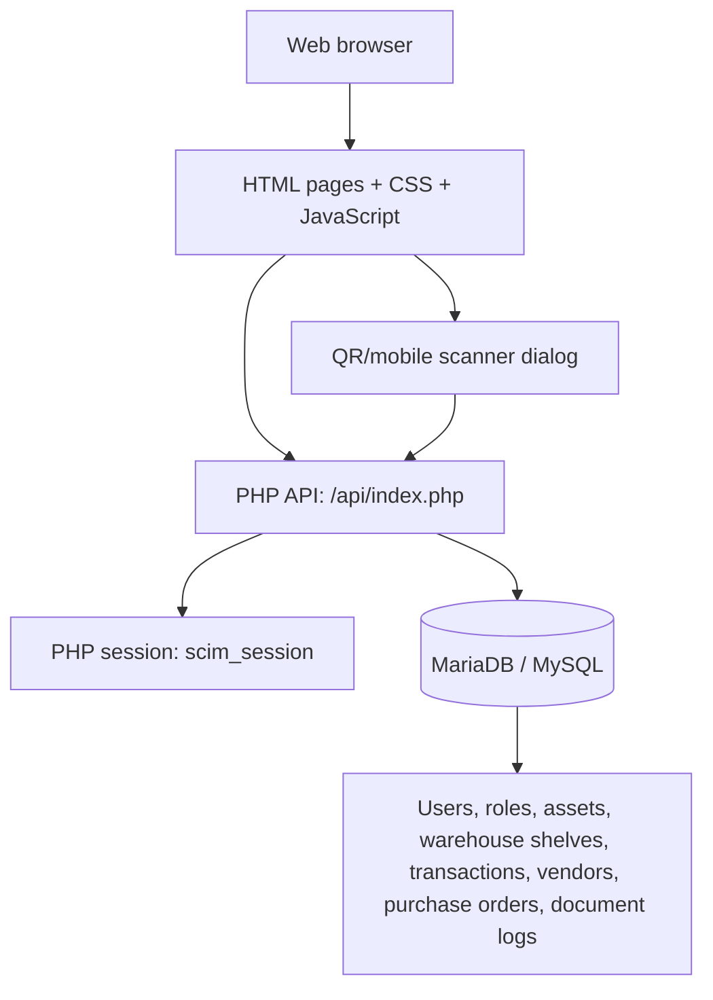

**Figure 1. Conceptual Framework**

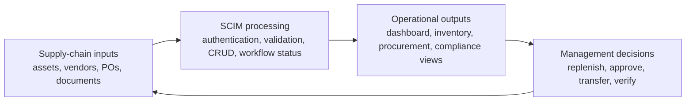

**Figure 2. Theoretical Paradigm — Input–Process–Output–Feedback**

### A.2 Information Systems Integration

The application integrates the browser UI with the internal PHP JSON API and a relational database. The deployment notes also define integration with HostForge infrastructure through either uploaded PHP files or a Docker build. No external SaaS, payment gateway, identity provider, message queue, or third-party business API is evidenced in the repository.

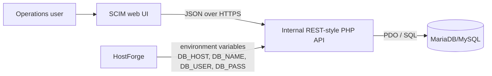

### A.3 Application Design and Development

The application uses a lightweight modular page design rather than a frontend framework. Each domain page generally has an HTML view and JavaScript behavior file, with shared styling in `styles.css`, `admin.css`, or `auth.css`. `dashboard.js` centralizes dashboard loading and renders statistics, purchase orders, warehouse zones, vendors, scans, and documents.

The API uses route checks on request method and path. Database statements use PDO prepared statements for user input in the inspected routes. Role checks are implemented for administrative and management operations.

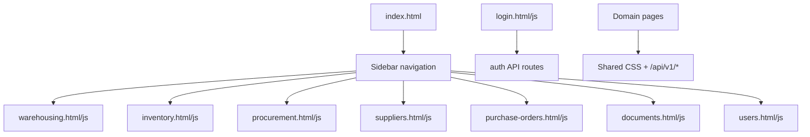

### A.4 Database Schema and Data Management

`init.sql` defines roles, users, login history, assets, warehouse shelves, asset transactions, vendors, purchase orders, and document logs. The API also contains a migration helper that creates core tables if needed. `asset_transactions.asset_id` references `assets.id`; other relationships should be validated and strengthened with foreign keys as the system evolves.

```mermaid
erDiagram
  ROLES ||--o{ USERS : assigns
  USERS ||--o{ LOGIN_HISTORY : produces
  ASSETS ||--o{ ASSET_TRANSACTIONS : records
  USERS {
    int id PK
    string full_name
    string email UK
    string password_hash
    string role
    boolean is_active
  }
  ROLES { int id PK; string name UK }
  LOGIN_HISTORY { int id PK; int user_id FK; string email; boolean success; string ip_address; datetime created_at }
  ASSETS { int id PK; string qr_code UK; string name; string category; decimal value; string status; string location }
  ASSET_TRANSACTIONS { int id PK; int asset_id FK; string action; datetime created_at }
  WAREHOUSE_SHELVES { int id PK; string zone; int capacity; int occupied }
  VENDORS { int id PK; string name; int on_time_rate; decimal defect_rate; decimal rating }
  PURCHASE_ORDERS { int id PK; string po_number; string vendor; decimal total; string status; datetime updated_at }
  DOCUMENT_LOGS { int id PK; string document_type; string reference_no; string owner; date due_date; string status }
```

**Data-management controls:** use least-privilege database credentials; keep `config.php` and secrets out of Git; use backups and restore tests; add indexes for QR code, email, status, and due dates; validate dates, amounts, identifiers, and status transitions; use migrations rather than destructive startup changes.

### A.5 Network Configuration

The documented deployment uses `scim.greatsolomonmpservices.com`, a dedicated document root, HTTPS, and port 80 inside the supplied container. TLS termination may be provided by HostForge or its reverse proxy; the repository itself does not define a reverse-proxy configuration.

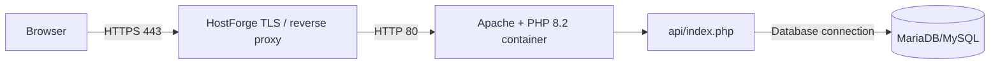

### A.6 Deployment and Infrastructure

`DEPLOY.md` documents two paths: standard PHP upload and HostForge Docker deployment. Standard deployment requires PHP 8.2+, a database, `init.sql`, and `config.php`. Docker deployment uses the supplied Dockerfile, installs `pdo` and `pdo_mysql`, enables Apache rewrite, copies the repository into `/var/www/html`, and exposes port 80. HostForge environment variables are preferred over committing database configuration.

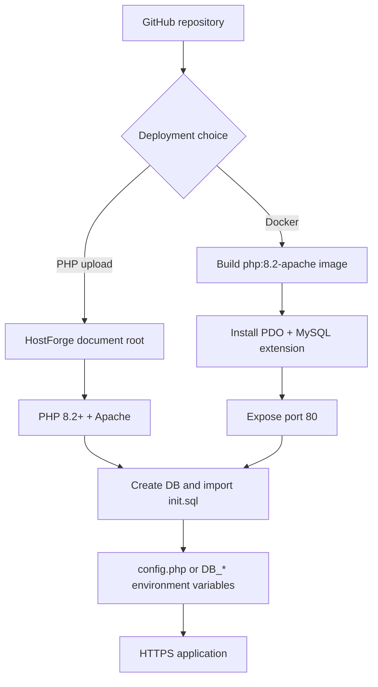

### A.7 Security Measures

Implemented or evidenced controls include PHP server-side sessions, `HttpOnly` and `SameSite=Lax` session cookies, conditional `Secure` cookies under HTTPS, login audit records, authenticated routes, role restrictions, prepared statements in inspected parameterized queries, and a deployment requirement to keep HTTPS enabled. The demo credentials in `DEPLOY.md` must be replaced before production.

Recommended controls not evidenced as complete include CSRF protection for state-changing requests, rate limiting and account lockout, centralized security logging, Content Security Policy, strict input/output encoding review, secret rotation, dependency scanning, backup encryption, and MFA implementation.

### A.8 Testing and Quality Assurance

No test suite, test runner, CI workflow, or coverage report was identified in the inspected repository. The following baseline acceptance matrix is recommended:

| Area | Acceptance test |
|---|---|
| Authentication | Valid login creates a session; invalid login is rejected and audited |
| Authorization | Admin-only and Manager-only routes reject insufficient roles |
| Inventory | Asset creation, lookup, and QR scan update the expected records |
| Dashboard | Statistics and operational lists render from API responses |
| Procurement | Purchase-order status changes persist and update timestamps |
| Documents | Compliance items and due dates are displayed correctly |
| Security | HTTPS, secure cookies, SQL injection, CSRF, and session expiry are tested |
| Deployment | Fresh database import and Docker startup work from documented steps |

### A.9 System Monitoring and Maintenance

The current application exposes no documented health endpoint, metrics exporter, centralized log sink, or alerting configuration. Operational monitoring should track HTTP availability, API error rate, authentication failures, database connectivity, query latency, container restarts, disk usage, backup freshness, and certificate expiry.

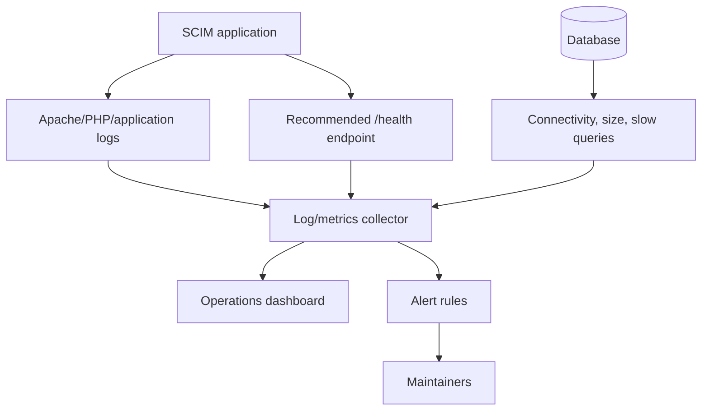

### A.10 APIs and Integration Points

The API is routed through `/api/v1/` and returns JSON. Evidenced endpoints include:

| Method | Endpoint | Purpose | Access |
|---|---|---|---|
| POST | `/api/v1/auth/login` | Authenticate user | Public |
| POST | `/api/v1/auth/logout` | Destroy session | Session |
| GET | `/api/v1/auth/me` | Return current user | Session |
| GET | `/api/v1/dashboard` | Dashboard aggregates and feeds | Authenticated |
| GET/POST | `/api/v1/assets` | List/create assets | Auth / Admin or Manager for create |
| GET | `/api/v1/assets/{qr_code}` | Find asset by QR code | Authenticated |
| POST | `/api/v1/assets/scan` | Record a scan action | Authenticated |
| GET | `/api/v1/pos/pending` | List purchase orders | Authenticated |
| PUT | `/api/v1/pos/{id}/status` | Change PO status | Admin or Manager |
| GET | `/api/v1/vendors` | List vendors | Authenticated |
| GET | `/api/v1/documents` | List document logs | Authenticated |
| GET/POST | `/api/v1/users` | List/create users | Admin |

```mermaid
flowchart LR
  Client[Browser fetch()] --> Gateway[Apache route /api/v1]
  Gateway --> Router[api/index.php router]
  Router --> AuthRoutes[Auth routes]
  Router --> AssetRoutes[Asset + scan routes]
  Router --> OpsRoutes[Dashboard, PO, vendor, document routes]
  Router --> AdminRoutes[User routes]
  AuthRoutes --> DB[(PDO / MySQL)]
  AssetRoutes --> DB
  OpsRoutes --> DB
  AdminRoutes --> DB
```

**Figure 12. API Gateway**

### A.11 User Documentation

1. Open the HTTPS application URL.
2. Sign in with an authorized account.
3. Use the sidebar to open dashboard, warehousing, inventory, procurement, suppliers, purchase orders, or documents.
4. Review dashboard statistics and status lists.
5. Use the mobile scanner dialog to select an action, enter or scan a QR code, and record the transaction.
6. Use profile controls to access user management where authorized, or log out.
7. Administrators should replace demo credentials, verify roles, and confirm database configuration before production use.

### A.12 Known Issues and Troubleshooting

- **Database configuration error:** verify `DB_HOST`, `DB_NAME`, `DB_USER`, and `DB_PASS`, or verify `config.php` for a non-container deployment.
- **API returns 401:** the server-side session is missing or expired; sign in again and verify cookie/HTTPS behavior.
- **API returns 403:** the logged-in account does not have the required role.
- **Page cannot load API:** confirm Apache rewrite behavior, document root, and that `/api/v1/*` reaches `api/index.php`.
- **Docker application unavailable:** inspect container logs and confirm port 80 is exposed and mapped by HostForge.
- **Incorrect dashboard values:** verify imported seed data, SQL status values, and database timestamps.
- **Production risk:** demo credentials and any default password must be removed or changed.
- **Evidence gap:** automated tests, production logs, monitoring, and backup procedures are not included in the repository and must be supplied separately.

### A.13 Version Control and Source Code Repository

The source repository is public at `https://github.com/franvaliente24-creator/scim`, with default branch `main`. The repository contains application source, SQL initialization, deployment documentation, and a Dockerfile. `.gitignore` and `.dockerignore` are present. No formal branching model, pull-request template, release policy, or semantic versioning policy was identified.

Recommended policy: protect `main`, require pull requests and review, prohibit secrets, tag production releases, document database migrations, and retain release notes.

### A.14 DevOps and CI/CD

A Docker build path exists, but no GitHub Actions workflow was identified in the inspected root contents. Therefore, continuous integration and continuous deployment should be treated as a recommended future capability, not a current repository feature.

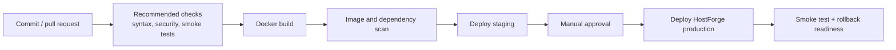

### A.15 Licensing and Open Source Libraries

The repository metadata reports no declared license. A license should be selected by the project owner before redistribution. The application’s direct runtime technologies are PHP 8.2+, Apache, PDO MySQL, MariaDB/MySQL, browser JavaScript, HTML, and CSS. No package manifest or dependency lockfile was identified in the inspected repository. A software bill of materials and attribution file should be added if external libraries are introduced.

### A.16 Performance Metrics and Monitoring

The application performs parallel dashboard requests in `dashboard.js` using `Promise.all`, which reduces sequential browser wait time. Database queries should be measured for dashboard aggregation, asset search, purchase-order listing, vendor listing, and document listing. Recommended service objectives are: availability, p95 API latency, p95 database latency, error rate, login failure rate, and scan completion time. Actual production measurements are not available from the repository.

## Appendix B: Project Management Artifacts

### B.1 Project Charter / Proposal

**Purpose:** provide a centralized supply-chain operations command center for inventory, warehousing, procurement, supplier performance, purchase orders, documents, and QR/mobile asset scans.

**Objectives:** centralize operational data; improve asset traceability; support role-based access; surface procurement and compliance work; enable deployable PHP/Docker hosting.

**Scope:** web UI, PHP JSON API, relational database, authentication, role restrictions, dashboard, inventory and scan workflows, procurement and document views, deployment configuration.

**Out of scope unless separately approved:** external ERP synchronization, mobile-native applications, payment processing, advanced warehouse automation, enterprise SSO, and production-grade observability.

**Stakeholders:** administrators, managers, warehouse/operations staff, procurement staff, supplier-facing coordinators, maintainers, and hosting/database operators.

**Success criteria:** reliable authenticated access; accurate asset and procurement records; successful deployment from documented instructions; auditable login and asset activity; secure production configuration.

### B.2 Sprint Backlogs and Burndown Charts

No historical sprint backlog or burndown data is present in the repository. The following proposed backlog can be used as a starting artifact:

| Sprint | Work items | Done criteria |
|---|---|---|
| 1 | Baseline deployment, database import, authentication review | App deploys; login/logout and session checks pass |
| 2 | Inventory and QR scan validation | Asset CRUD, lookup, and scan tests pass |
| 3 | Procurement, vendors, documents | API status and dashboard views verified |
| 4 | Security hardening and QA | CSRF, validation, role, and regression tests pass |
| 5 | Monitoring, backup, CI/CD | Health checks, alerts, pipeline, and rollback documented |

**Figure 4. Burndown Chart — proposed planning baseline**

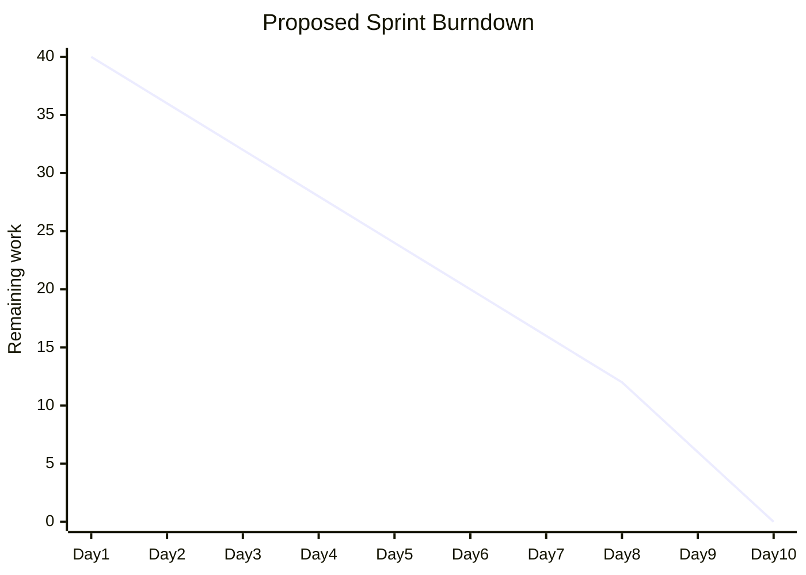

### B.3 Meeting Minutes

No meeting minutes were found in the repository. Recommended decision log template:

| Date | Participants | Decision | Rationale | Owner | Follow-up |
|---|---|---|---|---|---|
| TBD | Project team | Use PHP API + MariaDB/MySQL baseline | Matches repository implementation | Tech lead | Validate deployment |
| TBD | Project team | Use Dockerfile for managed hosting | Repeatable HostForge build | DevOps | Add CI smoke test |
| TBD | Security owner | Replace demo credentials before launch | Required production control | Admin | Verify password hashes |

### B.4 Gantt Chart or Project Timeline

The timeline below is a proposed plan, not a reconstruction of completed work.

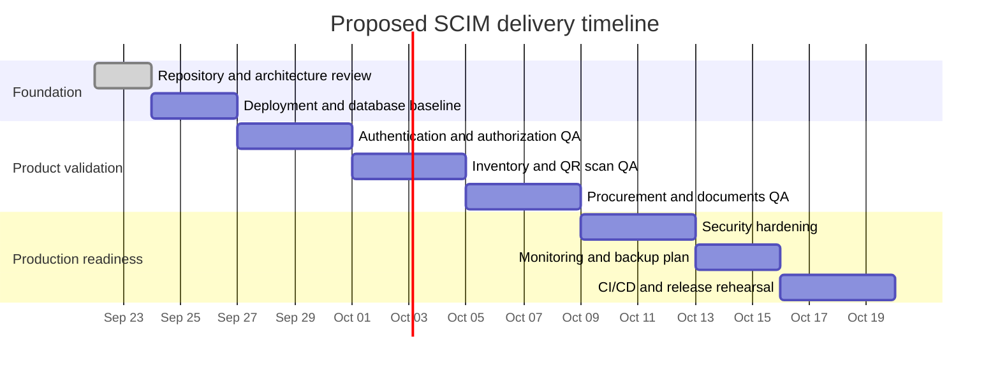

## List of Figures

1. Conceptual Framework — Section A.1
2. Theoretical Paradigm — Section A.1
3. Agile Scrum Framework — Section B.2 sprint plan
4. Burndown Chart — Section B.2
5. Microservices Diagram — not applicable as implemented; the system is a modular monolith. The architecture diagram in A.1 is the evidence-based alternative.
6. Communication Pattern — Section A.2 / A.5 browser-to-API-to-database flow
7. Data Flow Diagram — Section A.4 and A.10
8. CI/CD Pipeline — Section A.14
9. Infrastructure as Code (IaC) — Dockerfile-based container definition in A.6; no Terraform/Ansible evidence found
10. Monitoring and Alerting — Section A.9
11. Integration Diagram — Section A.2
12. API Gateway — Section A.10
13. Use Case Diagram — below
14. Sequence Diagram — below
15. Flowchart — below

### Figure 3. Agile Scrum Framework

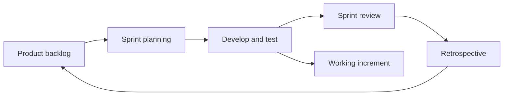

### Figure 5. Microservices Diagram — applicability note

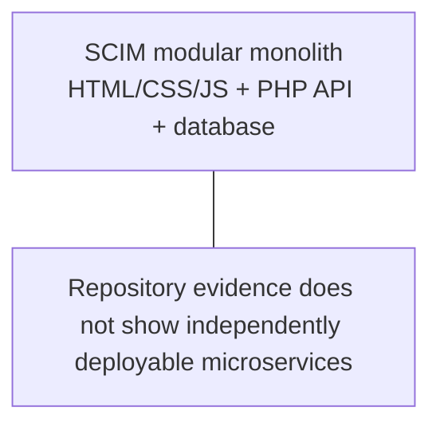

### Figure 6. Communication Pattern

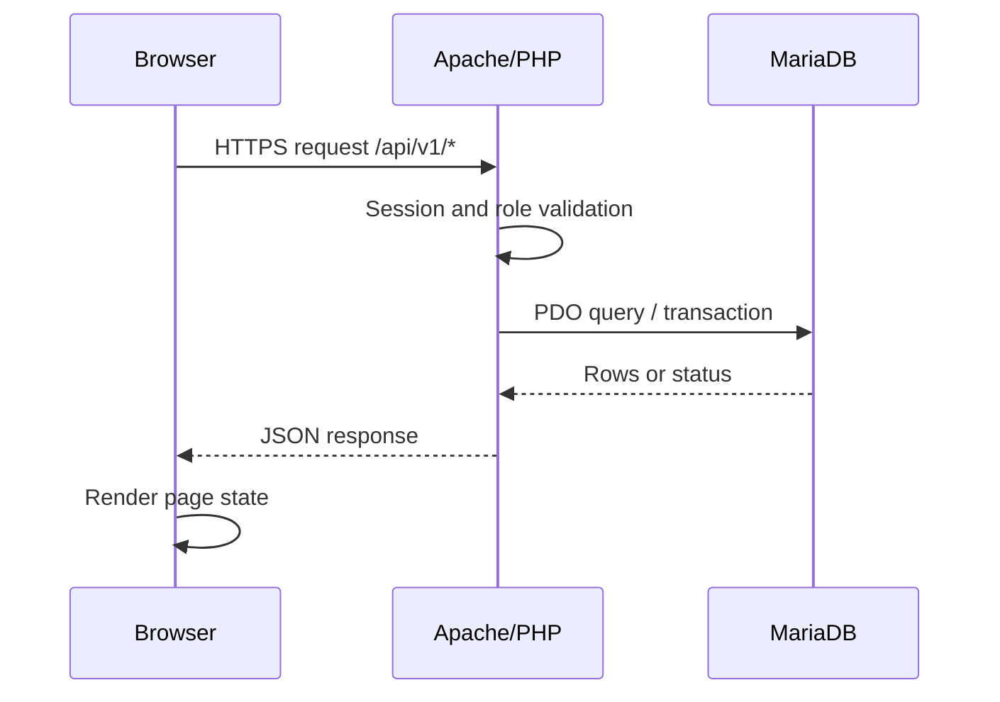

### Figure 7. Data Flow Diagram

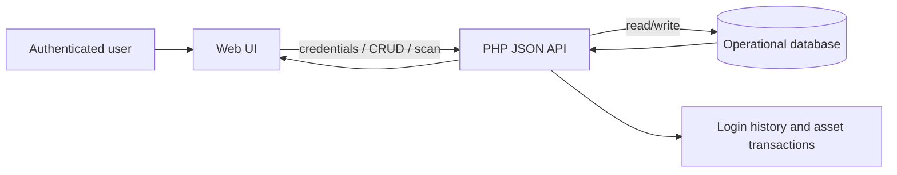

### Figure 9. Infrastructure as Code (IaC)

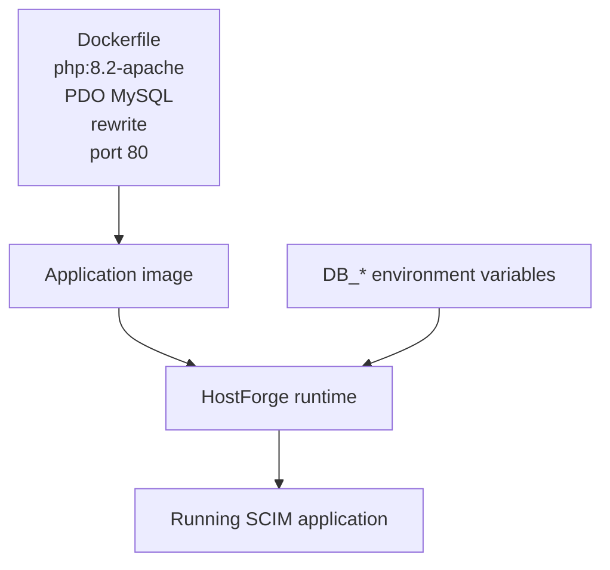

### Figure 11. Integration Diagram

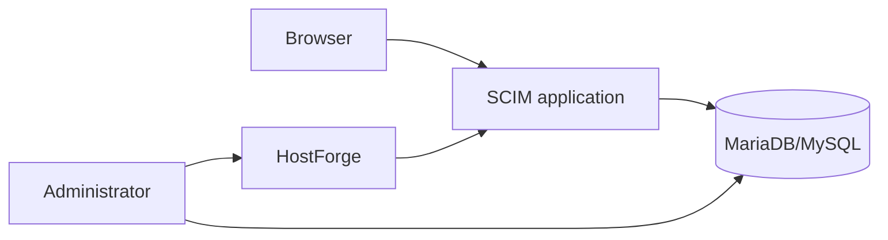

### Figure 13. Use Case Diagram

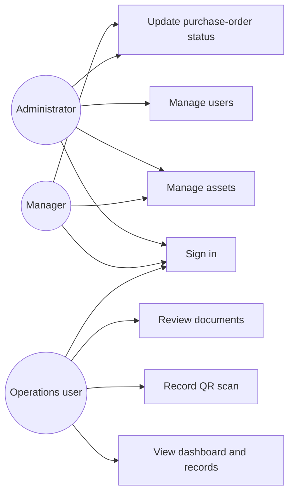

### Figure 14. Sequence Diagram

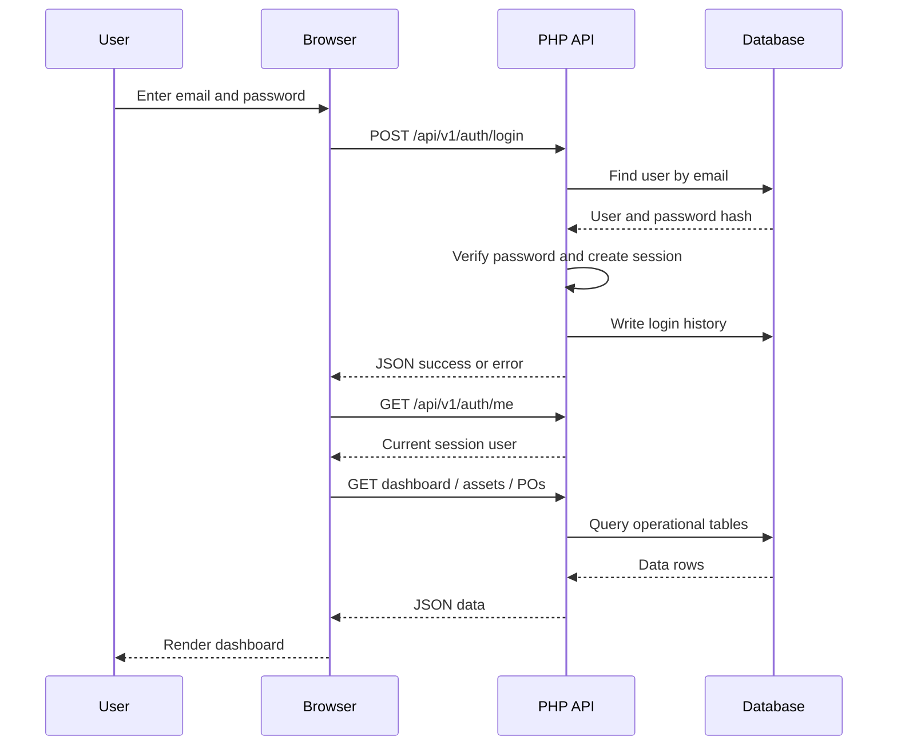

### Figure 15. Flowchart

```mermaid
flowchart TD
  Start([Open application]) --> Session{Valid session?}
  Session -->|No| Login[Show login page]
  Login --> Submit[Submit credentials]
  Submit --> Valid{Credentials valid?}
  Valid -->|No| Error[Show error and audit failure]
  Error --> Login
  Valid -->|Yes| Create[Create server-side session]
  Create --> Dashboard[Load dashboard]
  Session -->|Yes| Dashboard
  Dashboard --> Action{User action}
  Action -->|View data| GET[GET API endpoint]
  Action -->|Scan asset| POST[POST /assets/scan]
  Action -->|Admin change| Role{Authorized role?}
  Role -->|No| Denied[Return 403]
  Role -->|Yes| Change[Persist change]
  GET --> Render[Render JSON response]
  POST --> Render
  Change --> Render
  Render --> End([Continue session or log out])
```

## Source Evidence

- [Repository](https://github.com/franvaliente24-creator/scim)
- [Deployment guide](https://github.com/franvaliente24-creator/scim/blob/main/DEPLOY.md)
- [Dockerfile](https://github.com/franvaliente24-creator/scim/blob/main/Dockerfile)
- [API implementation](https://github.com/franvaliente24-creator/scim/blob/main/api/index.php)
- [Database initialization](https://github.com/franvaliente24-creator/scim/blob/main/init.sql)
- [Dashboard page](https://github.com/franvaliente24-creator/scim/blob/main/index.html)
- [Dashboard logic](https://github.com/franvaliente24-creator/scim/blob/main/dashboard.js)
- [Login logic](https://github.com/franvaliente24-creator/scim/blob/main/login.js)
